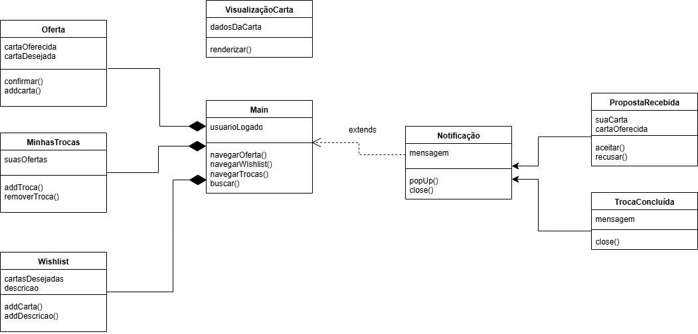
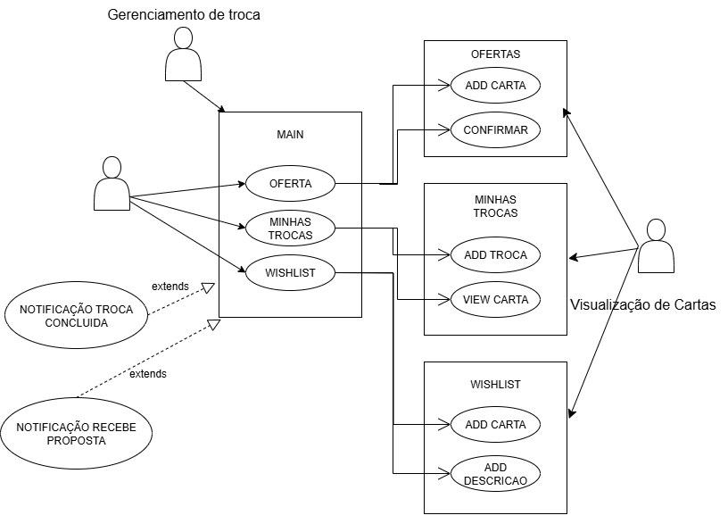

#  Visualização de Trocas

## Descrição do Tema:
  Responsável por disponibilizar ou aceitar propostas de trocas de cartas. Essa aplicação deve se comunicar com os serviços de jogadores e de trocas para que o jogador consiga disponibilizar alguma de suas cartas para troca, além de receber notificações quando algum outro jogador disponibilizar alguma de suas cartas. Quando um jogador solicitante receber uma proposta de troca ele também deve ser notificado e deve ter a opção de aceitar ou negar a proposta.

## Grupo
|**Nome**|**Matrícula**|
|--------|-------------|
|Eduardo Melo Bertozzi|360|
|Felipe Campos de Souza|453|
|Gabriel Cerantola Rigatto Morás|359|
|Henrique Junqueira Bicalho|X|
|Natália|X|
|Sofia Nogueira Groke|X|
|Vitor|X|

## Documentação
### Primeira Versão do UML de Classe

### Primeira Versão do UML de Caso Único

### Primeira Versão do Wireframe

