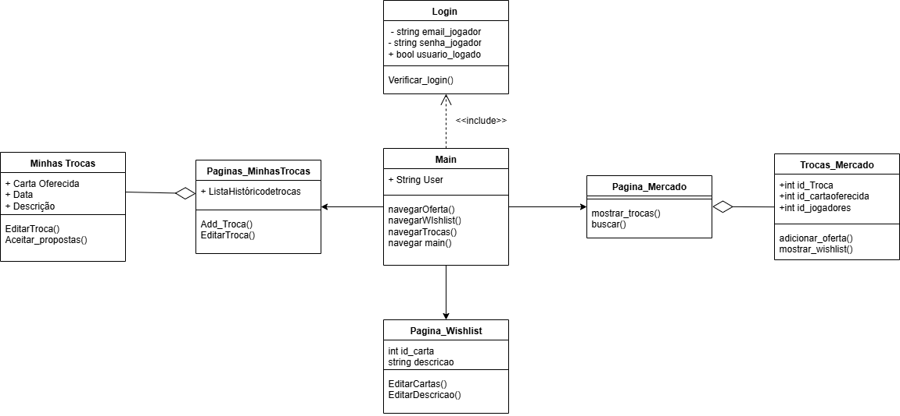
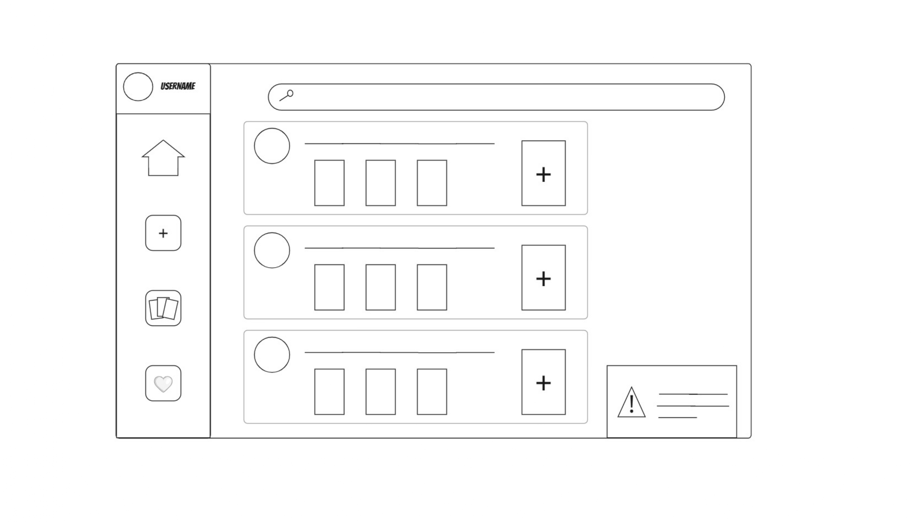

#  Visualização de Trocas

## Descrição do Tema
  Responsável pelo desenvolvimento de uma interface de usuário responsiva, projetada para garantir uma integração eficiente com os sistemas de troca. A aplicação frontend é responsável por gerenciar a comunicação com o backend, permitindo a realização de cadastros, autenticação de usuários (login) e acesso às funcionalidades do serviço de forma intuitiva.

## Grupo
|**Nome**|**Matrícula**|
|--------|-------------|
|Eduardo Melo Bertozzi|360|
|Felipe Campos de Souza|453|
|Gabriel Cerantola Rigatto Morás|359|
|Henrique Junqueira Bicalho|362|
|Nathália Aparecida Almeida Costa|508|
|Sofia Nogueira Groke|468|
|Victor Arruda Gorgal|524|

## Documentação
### Segunda Versão do UML de Classe

### Segunda Versão do UML de Caso Único

### Primeira Versão do Wireframe

